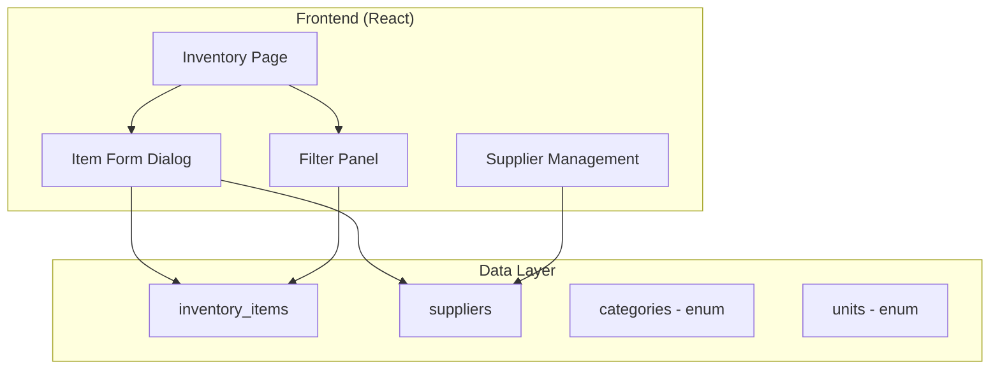

# Design Document: Inventory Categorization & Organization

## Overview

This feature extends the inventory module with categorization, supplier tracking, storage locations, and multiple units of measure. The design adds new database tables for suppliers, extends the inventory_items table with new fields, and enhances the UI with additional form fields and filters.

## Architecture



## Components and Interfaces

### Type Definitions

```typescript
// Item Categories
type ItemCategory = 
  | 'electrical'
  | 'mechanical'
  | 'consumables'
  | 'fluids'
  | 'safety'
  | 'tools'
  | 'fasteners'
  | 'filters'
  | 'batteries'
  | 'tires'
  | 'other';

// Units of Measure
type UnitOfMeasure = 
  | 'each'
  | 'pair'
  | 'box'
  | 'case'
  | 'pack'
  | 'roll'
  | 'gallon'
  | 'liter'
  | 'pound'
  | 'kilogram';

// Supplier
interface Supplier {
  id: string;
  name: string;
  contact_name: string | null;
  phone: string | null;
  email: string | null;
  address: string | null;
  notes: string | null;
  created_at: string;
  updated_at: string;
}

// Extended Inventory Item
interface InventoryItem {
  id: string;
  name: string;
  sku: string;
  description: string | null;
  quantity_on_hand: number;
  reorder_level: number;
  unit_price: number;
  // New fields
  categories: ItemCategory[];
  supplier_id: string | null;
  unit_of_measure: UnitOfMeasure;
  units_per_package: number; // Conversion factor (1 for 'each')
  warehouse: string | null;
  zone: string | null;
  aisle: string | null;
  bin: string | null;
  shelf: string | null;
  // Joined data
  supplier?: Supplier;
  created_at: string;
  updated_at: string;
}

// Filter State
interface InventoryFilters {
  stockStatus: string;
  categories: ItemCategory[];
  supplierId: string | null;
  warehouse: string | null;
  sortBy: string;
  sortOrder: 'asc' | 'desc';
}
```

### New/Updated Components

#### SupplierSelect
Dropdown for selecting a supplier with inline creation option.

```typescript
interface SupplierSelectProps {
  value: string | null;
  onChange: (supplierId: string | null) => void;
  allowCreate?: boolean;
}
```

#### CategoryMultiSelect
Multi-select component for item categories.

```typescript
interface CategoryMultiSelectProps {
  value: ItemCategory[];
  onChange: (categories: ItemCategory[]) => void;
}
```

#### StorageLocationFields
Group of fields for warehouse/zone/aisle/bin/shelf.

```typescript
interface StorageLocationFieldsProps {
  warehouse: string | null;
  zone: string | null;
  aisle: string | null;
  bin: string | null;
  shelf: string | null;
  onChange: (field: string, value: string | null) => void;
}
```

#### UnitOfMeasureSelect
Dropdown for unit selection with conversion factor input.

```typescript
interface UnitOfMeasureSelectProps {
  unit: UnitOfMeasure;
  unitsPerPackage: number;
  onUnitChange: (unit: UnitOfMeasure) => void;
  onUnitsPerPackageChange: (count: number) => void;
}
```

### Utility Functions

```typescript
// Format storage location for display
function formatStorageLocation(item: InventoryItem): string

// Calculate base unit quantity
function calculateBaseUnits(quantity: number, unitsPerPackage: number): number

// Format quantity with unit
function formatQuantityWithUnit(quantity: number, unit: UnitOfMeasure, unitsPerPackage: number): string

// Filter items by multiple criteria
function filterInventoryItems(items: InventoryItem[], filters: InventoryFilters): InventoryItem[]
```

## Data Models

### Database Schema Changes

```sql
-- New suppliers table
CREATE TABLE suppliers (
  id UUID PRIMARY KEY DEFAULT gen_random_uuid(),
  name TEXT NOT NULL,
  contact_name TEXT,
  phone TEXT,
  email TEXT,
  address TEXT,
  notes TEXT,
  created_at TIMESTAMPTZ NOT NULL DEFAULT NOW(),
  updated_at TIMESTAMPTZ NOT NULL DEFAULT NOW()
);

-- Add new columns to inventory_items
ALTER TABLE inventory_items
  ADD COLUMN categories TEXT[] DEFAULT '{}',
  ADD COLUMN supplier_id UUID REFERENCES suppliers(id) ON DELETE SET NULL,
  ADD COLUMN unit_of_measure TEXT NOT NULL DEFAULT 'each',
  ADD COLUMN units_per_package INTEGER NOT NULL DEFAULT 1,
  ADD COLUMN warehouse TEXT,
  ADD COLUMN zone TEXT,
  ADD COLUMN aisle TEXT,
  ADD COLUMN bin TEXT,
  ADD COLUMN shelf TEXT;

-- Indexes for filtering
CREATE INDEX idx_inventory_items_supplier ON inventory_items(supplier_id);
CREATE INDEX idx_inventory_items_warehouse ON inventory_items(warehouse);
CREATE INDEX idx_inventory_items_categories ON inventory_items USING GIN(categories);

-- RLS for suppliers
ALTER TABLE suppliers ENABLE ROW LEVEL SECURITY;

CREATE POLICY "Users can view suppliers"
  ON suppliers FOR SELECT TO authenticated USING (true);

CREATE POLICY "Users can manage suppliers"
  ON suppliers FOR ALL TO authenticated USING (true) WITH CHECK (true);
```

## Correctness Properties

*A property is a characteristic or behavior that should hold true across all valid executions of a system—essentially, a formal statement about what the system should do. Properties serve as the bridge between human-readable specifications and machine-verifiable correctness guarantees.*

### Property 1: Category Filter Accuracy

*For any* inventory item list and any selected category filter, all returned items SHALL have that category in their categories array.

**Validates: Requirements 1.4, 1.5**

### Property 2: Supplier Filter Accuracy

*For any* inventory item list and any selected supplier filter, all returned items SHALL have a supplier_id matching the filter value.

**Validates: Requirements 2.5**

### Property 3: Location Filter Accuracy

*For any* inventory item list and any warehouse or zone filter, all returned items SHALL have matching warehouse or zone values.

**Validates: Requirements 3.4**

### Property 4: Storage Location Format Consistency

*For any* inventory item with location data, the formatted location string SHALL follow the pattern "Warehouse > Zone > Aisle-Bin-Shelf", omitting empty segments.

**Validates: Requirements 3.5**

### Property 5: Base Unit Conversion Accuracy

*For any* inventory item with quantity Q and units_per_package U, the displayed base unit count SHALL equal Q × U.

**Validates: Requirements 4.4**

### Property 6: Multi-Filter AND Logic

*For any* combination of active filters, the returned items SHALL match ALL filter criteria simultaneously.

**Validates: Requirements 5.2**

### Property 7: Filter Count Accuracy

*For any* filter state, the displayed count SHALL equal the actual number of items in the filtered result set.

**Validates: Requirements 5.3**

## Error Handling

### Validation Errors

| Error Condition | User Message | Behavior |
|----------------|--------------|----------|
| Supplier name empty | "Supplier name is required" | Prevent save |
| Invalid email format | "Please enter a valid email address" | Highlight field |
| Units per package < 1 | "Units per package must be at least 1" | Prevent save |
| Duplicate supplier name | "A supplier with this name already exists" | Show warning |

### System Errors

| Error Condition | User Message | Behavior |
|----------------|--------------|----------|
| Failed to load suppliers | "Could not load suppliers. Please refresh." | Show retry button |
| Failed to save supplier | "Could not save supplier. Please try again." | Keep dialog open |

## Testing Strategy

### Unit Tests

- Storage location formatting function
- Base unit conversion calculation
- Filter logic for each filter type
- Category badge rendering

### Property-Based Tests

Using fast-check, implement tests for:

1. **Property 1**: Generate items with random categories, apply filter, verify all results match
2. **Property 4**: Generate random location data, verify format matches pattern
3. **Property 5**: Generate random quantities and conversion factors, verify calculation
4. **Property 6**: Generate random filter combinations, verify AND logic

### Integration Tests

- Supplier CRUD operations
- Item form with all new fields
- Filter panel with multiple active filters
- Category multi-select behavior

### Test Configuration

- Minimum 100 iterations per property test
- Tag format: **Feature: inventory-categorization, Property {number}: {property_text}**
