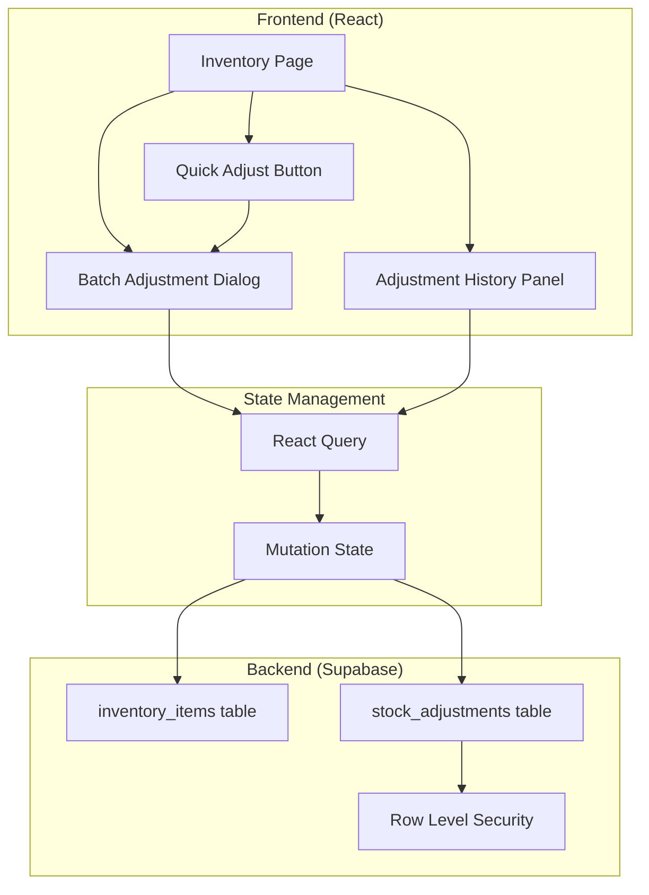

# Design Document: Inventory Stock Adjustments

## Overview

This feature extends the inventory module with batch stock adjustment capabilities and a comprehensive audit trail. The design follows the existing enterprise UI patterns and integrates with the current Supabase backend. Users can adjust multiple items in a single operation, categorize adjustments by reason, and view complete history of all stock changes.

## Architecture



## Components and Interfaces

### New Components

#### StockAdjustmentDialog
A slide-over dialog for creating batch stock adjustments.

```typescript
interface StockAdjustmentDialogProps {
  isOpen: boolean;
  onClose: () => void;
  onSuccess: () => void;
  preselectedItem?: InventoryItem | null; // For quick adjust
}

interface AdjustmentLineItem {
  inventoryItem: InventoryItem;
  quantityDelta: number;
  projectedQuantity: number;
}

interface AdjustmentFormState {
  lineItems: AdjustmentLineItem[];
  reason: AdjustmentReason;
  notes: string;
}
```

#### AdjustmentHistoryPanel
Displays adjustment history for a single item or globally.

```typescript
interface AdjustmentHistoryPanelProps {
  inventoryItemId?: string; // If provided, shows item-specific history
  isGlobal?: boolean; // If true, shows all adjustments with filters
}

interface AdjustmentHistoryFilters {
  dateFrom?: string;
  dateTo?: string;
  reason?: AdjustmentReason;
  inventoryItemId?: string;
}
```

#### AdjustmentReasonBadge
Displays the adjustment reason with appropriate styling.

```typescript
interface AdjustmentReasonBadgeProps {
  reason: AdjustmentReason;
}
```

### Type Definitions

```typescript
type AdjustmentReason = 
  | 'received'
  | 'damaged'
  | 'returned'
  | 'cycle_count'
  | 'theft'
  | 'expired'
  | 'transfer_out'
  | 'transfer_in'
  | 'initial_stock'
  | 'other';

interface StockAdjustment {
  id: string;
  inventory_item_id: string;
  quantity_delta: number;
  quantity_before: number;
  quantity_after: number;
  reason: AdjustmentReason;
  notes: string | null;
  created_by: string | null;
  created_at: string;
  // Joined data
  inventory_item?: InventoryItem;
  profile?: { first_name: string; last_name: string };
}

interface BatchAdjustmentInput {
  items: Array<{
    inventory_item_id: string;
    quantity_delta: number;
  }>;
  reason: AdjustmentReason;
  notes?: string;
}
```

### API Functions

```typescript
// Create batch adjustment (handles transaction)
async function createBatchAdjustment(input: BatchAdjustmentInput): Promise<StockAdjustment[]>

// Fetch adjustment history for an item
async function getItemAdjustmentHistory(itemId: string): Promise<StockAdjustment[]>

// Fetch global adjustment history with filters
async function getAdjustmentHistory(filters: AdjustmentHistoryFilters): Promise<StockAdjustment[]>

// Validate adjustment (check for negative results)
function validateAdjustment(item: InventoryItem, delta: number): { valid: boolean; error?: string }
```

## Data Models

### Database Schema

```sql
-- New table for stock adjustments
CREATE TABLE stock_adjustments (
  id UUID PRIMARY KEY DEFAULT gen_random_uuid(),
  inventory_item_id UUID NOT NULL REFERENCES inventory_items(id) ON DELETE SET NULL,
  quantity_delta INTEGER NOT NULL,
  quantity_before INTEGER NOT NULL,
  quantity_after INTEGER NOT NULL,
  reason TEXT NOT NULL CHECK (reason IN (
    'received', 'damaged', 'returned', 'cycle_count', 
    'theft', 'expired', 'transfer_out', 'transfer_in', 
    'initial_stock', 'other'
  )),
  notes TEXT,
  created_by UUID REFERENCES auth.users(id),
  created_at TIMESTAMPTZ NOT NULL DEFAULT NOW()
);

-- Index for efficient queries
CREATE INDEX idx_stock_adjustments_item ON stock_adjustments(inventory_item_id);
CREATE INDEX idx_stock_adjustments_created_at ON stock_adjustments(created_at DESC);
CREATE INDEX idx_stock_adjustments_reason ON stock_adjustments(reason);

-- RLS policies
ALTER TABLE stock_adjustments ENABLE ROW LEVEL SECURITY;

-- Allow authenticated users to read all adjustments
CREATE POLICY "Users can view stock adjustments"
  ON stock_adjustments FOR SELECT
  TO authenticated
  USING (true);

-- Allow authenticated users to insert adjustments
CREATE POLICY "Users can create stock adjustments"
  ON stock_adjustments FOR INSERT
  TO authenticated
  WITH CHECK (true);

-- Prevent updates and deletes (immutable audit trail)
-- No UPDATE or DELETE policies = no modifications allowed
```

### Supabase Types Update

```typescript
// Add to src/types/supabase.ts
export interface StockAdjustment {
  id: string;
  inventory_item_id: string;
  quantity_delta: number;
  quantity_before: number;
  quantity_after: number;
  reason: AdjustmentReason;
  notes: string | null;
  created_by: string | null;
  created_at: string;
}
```

## Correctness Properties

*A property is a characteristic or behavior that should hold true across all valid executions of a system—essentially, a formal statement about what the system should do. Properties serve as the bridge between human-readable specifications and machine-verifiable correctness guarantees.*

### Property 1: Search Filtering Accuracy

*For any* list of inventory items and any search term, filtering by that term SHALL return only items where the name or SKU contains the search term (case-insensitive).

**Validates: Requirements 1.2**

### Property 2: Projected Quantity Calculation

*For any* inventory item with current quantity Q and any quantity delta D, the projected quantity SHALL equal Q + D.

**Validates: Requirements 1.4**

### Property 3: Batch Update Atomicity

*For any* batch adjustment containing N items, either all N inventory items are updated and N adjustment records are created, or no changes occur (transaction rollback).

**Validates: Requirements 1.7**

### Property 4: Negative Quantity Prevention

*For any* inventory item with current quantity Q and any quantity delta D where Q + D < 0, the adjustment SHALL be rejected with a validation error.

**Validates: Requirements 1.8**

### Property 5: Adjustment Record Integrity

*For any* successful stock adjustment, the created StockAdjustment record SHALL contain: a valid id, the correct inventory_item_id, the exact quantity_delta, the quantity_before matching the item's previous quantity, the quantity_after matching quantity_before + quantity_delta, a valid reason, and the created_by matching the current user.

**Validates: Requirements 1.9, 4.1, 4.2**

### Property 6: Other Reason Requires Notes

*For any* adjustment submission where reason equals "other", the adjustment SHALL be rejected if notes is empty or whitespace-only.

**Validates: Requirements 2.2**

### Property 7: Item History Completeness

*For any* inventory item, the adjustment history displayed SHALL contain all StockAdjustment records where inventory_item_id matches that item's id.

**Validates: Requirements 3.1**

### Property 8: History Filter Correctness

*For any* combination of filters (date range, reason, item), the returned adjustment history SHALL contain only records matching all specified filter criteria.

**Validates: Requirements 3.4**

### Property 9: History Chronological Ordering

*For any* list of adjustment history records, the records SHALL be sorted by created_at in descending order (newest first).

**Validates: Requirements 3.5**

### Property 10: Adjustment Record Immutability

*For any* existing StockAdjustment record, attempts to update or delete the record SHALL fail.

**Validates: Requirements 4.3**

### Property 11: Quick Adjust Equivalence

*For any* quick adjustment on item I with delta D and reason R, the result SHALL be identical to a batch adjustment containing only item I with delta D and reason R.

**Validates: Requirements 5.3**

## Error Handling

### Validation Errors

| Error Condition | User Message | Behavior |
|----------------|--------------|----------|
| No items added to adjustment | "Please add at least one item to adjust" | Prevent submission |
| Negative result quantity | "Adjustment would result in negative quantity for {item}" | Highlight affected item, prevent submission |
| No reason selected | "Please select a reason for this adjustment" | Highlight reason field |
| "Other" without notes | "Please provide notes explaining this adjustment" | Highlight notes field |
| Duplicate item in batch | "Item already added to this adjustment" | Prevent adding duplicate |

### System Errors

| Error Condition | User Message | Behavior |
|----------------|--------------|----------|
| Database transaction failure | "Failed to save adjustment. Please try again." | Show error toast, keep dialog open |
| Network error | "Connection error. Please check your network." | Show error toast, allow retry |
| Concurrent modification | "Item quantity changed. Please refresh and try again." | Show error toast, refresh data |

## Testing Strategy

### Unit Tests

- Validation functions (negative quantity check, required fields)
- Projected quantity calculation
- Search filtering logic
- Reason badge color mapping

### Property-Based Tests

Using a property-based testing library (e.g., fast-check), implement tests for:

1. **Property 2**: Generate random quantities and deltas, verify calculation
2. **Property 4**: Generate items and deltas that would go negative, verify rejection
3. **Property 5**: Generate valid adjustments, verify all fields populated correctly
4. **Property 6**: Generate adjustments with "other" reason, verify notes validation
5. **Property 8**: Generate filter combinations, verify results match criteria
6. **Property 9**: Generate adjustment lists, verify sorting

### Integration Tests

- Batch adjustment creates correct number of records
- Adjustment history displays for specific item
- Global history filtering works correctly
- Quick adjust pre-populates correctly
- RLS policies prevent unauthorized modifications

### Test Configuration

- Minimum 100 iterations per property test
- Tag format: **Feature: inventory-stock-adjustments, Property {number}: {property_text}**
