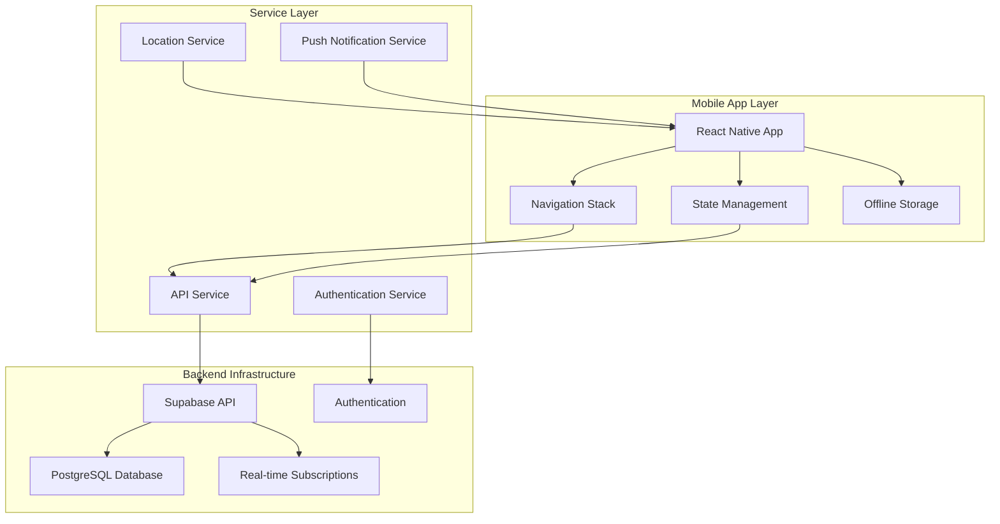

# Mobile Technician App Design Document

## Overview

The Mobile Technician App is a React Native-based mobile application that provides field technicians with essential CMMS functionality optimized for mobile devices. The app leverages the existing Supabase backend infrastructure while providing a streamlined, touch-optimized interface specifically designed for field operations.

## Architecture

### High-Level Architecture



### Technology Stack

- **Frontend Framework**: React Native with TypeScript
- **Navigation**: React Navigation 6
- **State Management**: TanStack Query + Zustand for local state
- **UI Components**: React Native Elements + Custom Components
- **Backend**: Existing Supabase infrastructure
- **Database**: PostgreSQL (existing schema)
- **Authentication**: Supabase Auth
- **Maps**: React Native Maps with Google Maps/Apple Maps
- **Push Notifications**: React Native Push Notification
- **Local Storage**: AsyncStorage + SQLite for complex data
- **Barcode Scanning**: React Native Camera + Vision

## Components and Interfaces

### Core Navigation Structure

```
TabNavigator (Bottom Tabs)
├── DashboardStack
│   ├── DashboardScreen
│   └── WorkOrderDetailsScreen
├── WorkOrdersStack
│   ├── WorkOrderListScreen
│   ├── WorkOrderDetailsScreen
│   └── WorkOrderFormScreen
├── AssetsStack
│   ├── AssetListScreen
│   ├── AssetDetailsScreen
│   └── QRScannerScreen
└── ProfileStack
    ├── ProfileScreen
    ├── SettingsScreen
    └── PerformanceScreen
```

### Key Components

#### 1. Dashboard Components
- **TechnicianDashboard**: Main dashboard with work order summary
- **WorkOrderCard**: Compact work order display with priority indicators
- **PerformanceMetrics**: Daily/weekly performance summary
- **QuickActions**: Fast access to common tasks

#### 2. Work Order Components
- **WorkOrderList**: Scrollable list with filtering and sorting
- **WorkOrderDetails**: Comprehensive work order information
- **StatusUpdateModal**: Quick status change interface
- **PartsUsageForm**: Parts selection and quantity input
- **CompletionForm**: Work order completion with validation

#### 3. Asset Management Components
- **AssetCard**: Vehicle/asset information display
- **QRScanner**: Camera-based QR code scanning
- **AssetHistory**: Maintenance history timeline
- **AssetSpecs**: Technical specifications display

#### 4. Location Components
- **LocationMap**: Integrated map with work order locations
- **NavigationButton**: One-tap navigation to external apps
- **ProximityDetector**: Automatic location-based check-in
- **LocationPicker**: Manual location selection

#### 5. Inventory Components
- **PartsList**: Searchable parts inventory
- **BarcodeScanner**: Parts identification via barcode
- **InventoryCard**: Part information with stock levels
- **UsageTracker**: Parts usage recording

### Data Models

#### Work Order Model (Extended)
```typescript
interface MobileWorkOrder extends WorkOrder {
  // Additional mobile-specific fields
  distanceFromTechnician?: number;
  estimatedTravelTime?: number;
  lastSyncTimestamp?: string;
  localChanges?: boolean;
  priority: 'Low' | 'Medium' | 'High' | 'Emergency';
  mobileStatus: 'assigned' | 'traveling' | 'on_site' | 'in_progress' | 'completed';
}
```

#### Technician Location Model
```typescript
interface TechnicianLocation {
  id: string;
  technicianId: string;
  latitude: number;
  longitude: number;
  accuracy: number;
  timestamp: string;
  isOnSite: boolean;
  currentWorkOrderId?: string;
}
```

#### Mobile Session Model
```typescript
interface MobileSession {
  technicianId: string;
  deviceId: string;
  lastSyncTimestamp: string;
  isOnline: boolean;
  currentLocation?: TechnicianLocation;
  activeWorkOrderId?: string;
  pendingChanges: number;
}
```

## Error Handling

### Error Categories and Responses

#### 1. Network Errors
- **Connection Lost**: Display offline indicator, queue changes locally
- **Slow Connection**: Show loading states, implement request timeouts
- **Server Errors**: Retry mechanism with exponential backoff

#### 2. Authentication Errors
- **Token Expired**: Automatic refresh with fallback to login
- **Permission Denied**: Clear error messages with contact information
- **Account Locked**: Display lockout reason and unlock instructions

#### 3. Data Validation Errors
- **Required Fields**: Inline validation with clear error messages
- **Invalid Data**: Format hints and correction suggestions
- **Constraint Violations**: Business rule explanations

#### 4. Device-Specific Errors
- **Camera Access**: Permission request with usage explanation
- **Location Services**: GPS enablement guidance
- **Storage Full**: Cache cleanup with user notification

### Error Recovery Strategies

```typescript
interface ErrorRecoveryStrategy {
  errorType: string;
  retryAttempts: number;
  retryDelay: number;
  fallbackAction?: () => void;
  userNotification: string;
}
```

## Testing Strategy

### Testing Pyramid

#### 1. Unit Tests (70%)
- **Component Logic**: State management, data transformations
- **Service Functions**: API calls, data validation, business logic
- **Utility Functions**: Date formatting, calculations, helpers
- **Custom Hooks**: Location tracking, work order management

#### 2. Integration Tests (20%)
- **API Integration**: Supabase client interactions
- **Navigation Flow**: Screen transitions and parameter passing
- **State Synchronization**: TanStack Query cache management
- **Push Notifications**: Notification handling and routing

#### 3. End-to-End Tests (10%)
- **Critical User Journeys**: Work order completion flow
- **Authentication Flow**: Login, logout, token refresh
- **Offline Scenarios**: Network disconnection handling
- **Performance Tests**: App launch time, navigation speed

### Testing Tools
- **Unit Testing**: Jest + React Native Testing Library
- **Integration Testing**: Detox for E2E testing
- **Performance Testing**: Flipper + React Native Performance
- **Device Testing**: Physical devices + simulators

## Security Considerations

### Authentication and Authorization
- **Biometric Authentication**: Fingerprint/Face ID for quick access
- **Token Management**: Secure storage with automatic refresh
- **Session Management**: Automatic logout after inactivity
- **Role-Based Access**: Technician-specific permissions

### Data Protection
- **Local Data Encryption**: Sensitive data encrypted at rest
- **Secure Communication**: HTTPS/WSS for all API calls
- **PII Handling**: Customer data protection compliance
- **Audit Logging**: User action tracking for security

### Device Security
- **Root/Jailbreak Detection**: Security warnings for compromised devices
- **App Integrity**: Code signing and tamper detection
- **Remote Wipe**: Admin capability to clear app data
- **Secure Storage**: Keychain/Keystore for sensitive data

## Performance Optimization

### App Performance
- **Bundle Optimization**: Code splitting and lazy loading
- **Image Optimization**: Compressed images with caching
- **Memory Management**: Efficient component lifecycle management
- **Battery Optimization**: Background task management

### Network Performance
- **Request Batching**: Combine multiple API calls
- **Caching Strategy**: Intelligent data caching with TTL
- **Compression**: GZIP compression for API responses
- **Prefetching**: Anticipatory data loading

### UI Performance
- **List Virtualization**: Efficient rendering of large lists
- **Image Lazy Loading**: Load images as needed
- **Animation Optimization**: 60fps animations with native driver
- **Touch Response**: Immediate feedback for user interactions

## Deployment and Distribution

### Build Configuration
- **Environment Management**: Development, staging, production configs
- **Code Signing**: iOS certificates and Android keystores
- **Bundle Optimization**: Platform-specific optimizations
- **Asset Management**: Image and font optimization

### Distribution Strategy
- **Internal Distribution**: TestFlight (iOS) and Internal App Sharing (Android)
- **App Store Deployment**: Automated CI/CD pipeline
- **Over-the-Air Updates**: CodePush for quick updates
- **Version Management**: Semantic versioning with rollback capability

### Monitoring and Analytics
- **Crash Reporting**: Sentry for error tracking
- **Performance Monitoring**: Firebase Performance
- **Usage Analytics**: Custom analytics for feature usage
- **User Feedback**: In-app feedback collection

## Integration Points

### Existing CMMS Integration
- **API Compatibility**: Full compatibility with existing Supabase API
- **Data Synchronization**: Real-time sync with web application
- **User Management**: Shared user accounts and permissions
- **Notification System**: Unified notification system

### Third-Party Integrations
- **Maps Integration**: Google Maps (Android) / Apple Maps (iOS)
- **Push Notifications**: Firebase Cloud Messaging
- **Camera Services**: Native camera with ML Kit for QR/barcode scanning
- **Location Services**: Native GPS with background location tracking

### Future Integration Considerations
- **IoT Device Integration**: Bluetooth connectivity for diagnostic tools
- **Voice Assistant Integration**: Siri/Google Assistant shortcuts
- **Wearable Integration**: Apple Watch/Wear OS companion app
- **Fleet Management**: Integration with vehicle tracking systems

## Accessibility and Usability

### Accessibility Features
- **Screen Reader Support**: VoiceOver/TalkBack compatibility
- **High Contrast Mode**: Enhanced visibility for low vision users
- **Large Text Support**: Dynamic type scaling
- **Voice Control**: Voice navigation and input support

### Usability Optimizations
- **One-Handed Operation**: Bottom navigation and reachable controls
- **Gesture Support**: Swipe actions for common tasks
- **Haptic Feedback**: Tactile feedback for important actions
- **Dark Mode Support**: System-wide dark theme support

### Field-Specific Considerations
- **Sunlight Readability**: High contrast design for outdoor use
- **Glove-Friendly Interface**: Large touch targets for gloved hands
- **Dust/Water Resistance**: UI considerations for harsh environments
- **Quick Actions**: Minimal taps for common workflows

## Scalability and Maintenance

### Code Organization
- **Feature-Based Structure**: Modular architecture for easy maintenance
- **Shared Components**: Reusable UI components library
- **Type Safety**: Comprehensive TypeScript coverage
- **Documentation**: Inline documentation and README files

### Scalability Considerations
- **Horizontal Scaling**: Support for multiple technician teams
- **Data Pagination**: Efficient handling of large datasets
- **Caching Strategy**: Multi-level caching for performance
- **Background Processing**: Efficient handling of sync operations

### Maintenance Strategy
- **Automated Testing**: Comprehensive test suite with CI/CD
- **Code Quality**: ESLint, Prettier, and SonarQube integration
- **Dependency Management**: Regular updates with security patches
- **Performance Monitoring**: Continuous performance tracking

This design provides a comprehensive foundation for building a robust, scalable mobile technician app that integrates seamlessly with the existing CMMS infrastructure while providing an optimized mobile experience for field technicians.