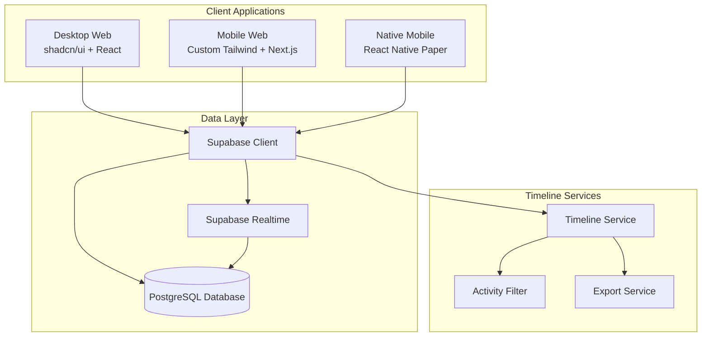
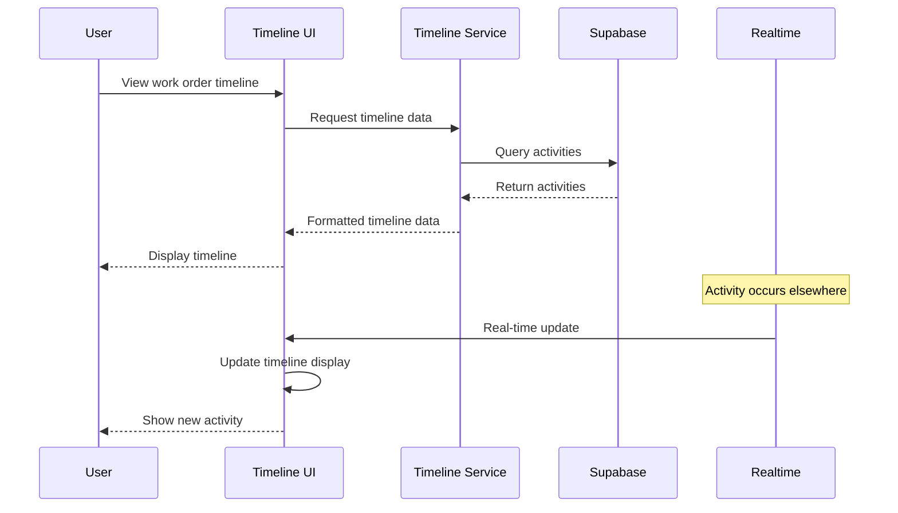

# Design Document: Vertical Activity Timeline

## Overview

The Vertical Activity Timeline feature provides a comprehensive chronological view of work order activities across desktop, mobile web, and native mobile platforms. The design leverages modern UI patterns for timeline visualization, real-time data synchronization via Supabase, and platform-specific optimizations while maintaining consistent functionality.

Key design principles:
- **Chronological clarity**: Activities displayed in reverse chronological order with clear visual hierarchy
- **Real-time synchronization**: Live updates across all connected clients using Supabase Realtime
- **Cross-platform consistency**: Unified data layer with platform-optimized UI implementations
- **Performance optimization**: Virtual scrolling and pagination for large activity datasets
- **Accessibility**: WCAG compliant with keyboard navigation and screen reader support

## Architecture

### High-Level Architecture



### Data Flow Architecture



## Components and Interfaces

### Core Components

#### 1. Timeline Container
**Purpose**: Main container component that orchestrates timeline display and interactions

**Desktop Implementation** (`src/components/timeline/TimelineContainer.tsx`):
```typescript
interface TimelineContainerProps {
  workOrderId: string;
  filters?: TimelineFilters;
  onActivityAdd?: (activity: Activity) => void;
}

// Uses shadcn/ui components with default styling
<Card>
  <CardHeader>
    <CardTitle>Activity Timeline</CardTitle>
    <TimelineFilters />
  </CardHeader>
  <CardContent>
    <ScrollArea className="h-[600px]">
      <TimelineList activities={activities} />
    </ScrollArea>
  </CardContent>
</Card>
```

**Mobile Web Implementation** (`mobile-web/components/timeline/TimelineContainer.tsx`):
```typescript
// Custom Tailwind with touch-optimized interactions
<div className="bg-white rounded-lg shadow-sm">
  <div className="p-4 border-b">
    <h2 className="text-lg font-semibold">Activity Timeline</h2>
    <TimelineFilters />
  </div>
  <div className="max-h-[70vh] overflow-y-auto">
    <TimelineList activities={activities} />
  </div>
</div>
```

**Native Implementation** (`mobile/src/components/timeline/TimelineContainer.tsx`):
```typescript
// React Native Paper components
<Card elevation={2}>
  <Card.Title title="Activity Timeline" />
  <Card.Content>
    <TimelineFilters />
    <FlatList
      data={activities}
      renderItem={({ item }) => <TimelineItem activity={item} />}
      keyExtractor={(item) => item.id}
    />
  </Card.Content>
</Card>
```

#### 2. Timeline Item
**Purpose**: Individual activity display component with type-specific styling

**Activity Type Indicators**:
- **Created**: Plus icon, blue color
- **Assigned**: User icon, green color  
- **Started**: Play icon, orange color
- **Paused**: Pause icon, yellow color
- **Completed**: Check icon, green color
- **Note Added**: Message icon, gray color

#### 3. Timeline Filters
**Purpose**: Filter controls for date range, activity type, and technician

**Filter Types**:
- Date range picker (last 7 days, 30 days, custom range)
- Activity type multi-select checkboxes
- Technician dropdown with search
- Clear all filters button

#### 4. Add Note Interface
**Purpose**: Inline note addition with rich text support

**Features**:
- Expandable text area
- Rich text formatting (bold, italic, lists)
- Character count indicator
- Save/cancel actions
- Real-time preview

### Service Layer

#### Timeline Service
```typescript
interface TimelineService {
  getActivities(workOrderId: string, filters?: TimelineFilters): Promise<Activity[]>;
  addNote(workOrderId: string, content: string, userId: string): Promise<Activity>;
  subscribeToUpdates(workOrderId: string, callback: (activity: Activity) => void): () => void;
  exportTimeline(workOrderId: string, format: 'pdf' | 'csv', filters?: TimelineFilters): Promise<Blob>;
}
```

#### Real-time Update Manager
```typescript
interface RealtimeManager {
  subscribe(workOrderId: string): RealtimeSubscription;
  unsubscribe(subscription: RealtimeSubscription): void;
  handleConnectionLoss(): void;
  syncPendingUpdates(): Promise<void>;
}
```

## Data Models

### Activity Model
```typescript
interface Activity {
  id: string;
  work_order_id: string;
  activity_type: ActivityType;
  title: string;
  description?: string;
  user_id: string;
  user_name: string;
  user_avatar?: string;
  created_at: string;
  metadata?: ActivityMetadata;
}

type ActivityType = 
  | 'created'
  | 'assigned' 
  | 'started'
  | 'paused'
  | 'completed'
  | 'note_added'
  | 'status_changed'
  | 'priority_changed';

interface ActivityMetadata {
  previous_value?: string;
  new_value?: string;
  assigned_to?: string;
  assigned_by?: string;
  note_content?: string;
  attachments?: string[];
}
```

### Timeline Filters Model
```typescript
interface TimelineFilters {
  dateRange?: {
    start: Date;
    end: Date;
  };
  activityTypes?: ActivityType[];
  technicianIds?: string[];
  searchQuery?: string;
}
```

### Database Schema

#### Activities Table
```sql
CREATE TABLE work_order_activities (
  id UUID PRIMARY KEY DEFAULT gen_random_uuid(),
  work_order_id UUID NOT NULL REFERENCES work_orders(id),
  activity_type VARCHAR(50) NOT NULL,
  title VARCHAR(255) NOT NULL,
  description TEXT,
  user_id UUID NOT NULL REFERENCES users(id),
  user_name VARCHAR(255) NOT NULL,
  user_avatar VARCHAR(500),
  metadata JSONB,
  created_at TIMESTAMP WITH TIME ZONE DEFAULT NOW(),
  
  INDEX idx_work_order_activities_work_order_id (work_order_id),
  INDEX idx_work_order_activities_created_at (created_at),
  INDEX idx_work_order_activities_type (activity_type),
  INDEX idx_work_order_activities_user (user_id)
);

-- Enable real-time subscriptions
ALTER TABLE work_order_activities REPLICA IDENTITY FULL;
```

#### Real-time Subscription Setup
```sql
-- Enable real-time for activities table
ALTER PUBLICATION supabase_realtime ADD TABLE work_order_activities;
```

## Correctness Properties

*A property is a characteristic or behavior that should hold true across all valid executions of a system—essentially, a formal statement about what the system should do. Properties serve as the bridge between human-readable specifications and machine-verifiable correctness guarantees.*

Based on the prework analysis and property reflection to eliminate redundancy, here are the key correctness properties:

**Property 1: Chronological ordering consistency**
*For any* set of activities with different timestamps, the timeline display should show them in reverse chronological order (most recent first) and data retrieval should return them in accurate chronological order
**Validates: Requirements 1.1, 9.2**

**Property 2: Complete activity data display**
*For any* activity, the timeline display should show all required information including activity type, timestamp, user information, description, and for assignment activities both assigner and assignee information, and for status changes both previous and new values
**Validates: Requirements 1.2, 2.3, 2.4, 2.5**

**Property 3: Activity type visual distinction**
*For any* set of activities with different types, each activity type should have unique visual indicators (icons and colors) that are consistently applied across the timeline display
**Validates: Requirements 1.5, 2.2**

**Property 4: Date grouping accuracy**
*For any* set of activities spanning multiple days, the timeline display should group activities by date with clear date separators between different days
**Validates: Requirements 1.3**

**Property 5: Activity type tracking completeness**
*For any* work order event (created, assigned, started, paused, completed, note_added), the activity tracker should record an appropriate activity with the correct type
**Validates: Requirements 2.1**

**Property 6: Compound filtering accuracy**
*For any* combination of date range, activity type, and technician filters, the timeline filter should show only activities that match all applied filter criteria, and when filters are cleared, should restore the complete timeline view
**Validates: Requirements 3.1, 3.2, 3.3, 3.4, 3.5**

**Property 7: Real-time update integration**
*For any* new activity received via real-time updates, the timeline display should add the activity without page refresh and provide subtle visual feedback to indicate the new activity
**Validates: Requirements 4.2, 4.5**

**Property 8: Note processing completeness**
*For any* valid note submission, the note processor should validate the content, save it as a new timeline activity, and the timeline display should immediately show the new note activity
**Validates: Requirements 5.2, 5.4**

**Property 9: Rich text formatting support**
*For any* note with rich text formatting, the note interface should preserve and display the formatting correctly
**Validates: Requirements 5.3**

**Property 10: Error handling consistency**
*For any* note addition failure, the note interface should display appropriate error messages and provide retry functionality
**Validates: Requirements 5.5**

**Property 11: Platform-specific interaction optimization**
*For any* platform (desktop with hover/keyboard, mobile web with touch targets), the timeline display should provide appropriate interaction methods while maintaining core functionality
**Validates: Requirements 6.1, 6.2**

**Property 12: Cross-platform data consistency**
*For any* work order timeline, the data should remain consistent and synchronized when accessed from different platforms
**Validates: Requirements 6.4**

**Property 13: Export completeness and format support**
*For any* timeline export request, the export generator should create a downloadable report containing all visible timeline activities with timestamps, types, users, and descriptions in the requested format (PDF or CSV), and when filters are applied, should export only the filtered data
**Validates: Requirements 7.1, 7.2, 7.3, 7.4**

**Property 14: Export error handling**
*For any* export generation failure, the export interface should provide clear error messages and retry options
**Validates: Requirements 7.5**

**Property 15: Performance optimization with large datasets**
*For any* work order with extensive activity history, the timeline display should implement virtual scrolling and the data loader should implement pagination to maintain performance
**Validates: Requirements 8.1, 8.2**

**Property 16: Search functionality accuracy**
*For any* search query on large activity datasets, the timeline display should return only activities that match the search criteria
**Validates: Requirements 8.5**

**Property 17: Data persistence integrity**
*For any* activity creation, the data persister should store it with immutable timestamps and user attribution, and the data validator should verify all required fields are present and valid
**Validates: Requirements 9.1, 9.4**

**Property 18: Historical data immutability**
*For any* historical activity access, the timeline display should show activities exactly as they were recorded without modification
**Validates: Requirements 9.5**

<function_calls>
<invoke name="prework">
<parameter name="featureName">vertical-activity-timeline

## Error Handling

### Client-Side Error Handling

#### Network Connectivity Issues
- **Connection Loss**: Queue real-time updates locally and sync when connection is restored
- **API Failures**: Display user-friendly error messages with retry options
- **Timeout Handling**: Implement exponential backoff for failed requests

#### Data Validation Errors
- **Invalid Activity Data**: Validate all activity fields before display and storage
- **Malformed Timestamps**: Handle timezone conversion errors gracefully
- **Missing User Information**: Provide fallback display for activities with incomplete user data

#### UI Error States
- **Loading States**: Show skeleton loaders during data fetching
- **Empty States**: Display helpful messages when no activities exist
- **Filter No Results**: Show clear messaging when filters return no activities

### Server-Side Error Handling

#### Database Errors
- **Connection Failures**: Implement connection pooling and retry logic
- **Query Timeouts**: Optimize queries and implement proper indexing
- **Data Integrity**: Use database constraints to prevent invalid activity records

#### Real-time Subscription Errors
- **Subscription Failures**: Automatically reconnect with exponential backoff
- **Message Delivery**: Ensure at-least-once delivery for critical activity updates
- **Client Disconnection**: Clean up subscriptions to prevent memory leaks

### Error Recovery Strategies

#### Graceful Degradation
- **Real-time Unavailable**: Fall back to periodic polling for updates
- **Export Service Down**: Queue export requests and notify when available
- **Search Unavailable**: Disable search UI and show notification

#### Data Consistency
- **Sync Conflicts**: Use timestamp-based conflict resolution
- **Partial Updates**: Ensure atomic operations for activity creation
- **Cache Invalidation**: Clear stale data when errors occur

## Testing Strategy

### Dual Testing Approach

The testing strategy employs both unit testing and property-based testing as complementary approaches:

- **Unit Tests**: Focus on specific examples, edge cases, and error conditions
- **Property Tests**: Verify universal properties across all inputs through randomized testing
- **Integration Tests**: Validate component interactions and real-time functionality

### Property-Based Testing Configuration

**Library Selection**:
- **Desktop/Mobile Web**: Use `fast-check` for TypeScript/JavaScript property testing
- **Native Mobile**: Use `fast-check` with React Native testing framework

**Test Configuration**:
- Minimum 100 iterations per property test to ensure comprehensive coverage
- Each property test references its corresponding design document property
- Tag format: **Feature: vertical-activity-timeline, Property {number}: {property_text}**

### Unit Testing Focus Areas

**Specific Examples**:
- Empty timeline state display (edge case from requirements 1.4)
- Add note button click interaction (example from requirements 5.1)
- Export generation with no activities (edge case)

**Integration Points**:
- Supabase real-time subscription setup and cleanup
- Cross-platform data synchronization
- Filter state management across components

**Error Conditions**:
- Network failures during activity loading
- Invalid activity data handling
- Export generation failures

### Property Testing Implementation

Each correctness property will be implemented as a property-based test:

**Example Property Test Structure**:
```typescript
// Feature: vertical-activity-timeline, Property 1: Chronological ordering consistency
test('activities are displayed in reverse chronological order', () => {
  fc.assert(fc.property(
    fc.array(activityGenerator, { minLength: 2 }),
    (activities) => {
      const sortedActivities = sortActivitiesForDisplay(activities);
      return isInReverseChronologicalOrder(sortedActivities);
    }
  ), { numRuns: 100 });
});
```

**Test Data Generators**:
- Activity generator with random timestamps, types, and user data
- Filter criteria generator for compound filtering tests
- Large dataset generator for performance testing
- Rich text content generator for note formatting tests

### Cross-Platform Testing Strategy

**Desktop Testing** (`src/`):
- Jest + React Testing Library for component testing
- Playwright for end-to-end timeline interactions
- Focus on hover states and keyboard navigation

**Mobile Web Testing** (`mobile-web/`):
- Jest + React Testing Library with touch event simulation
- Cypress for mobile-specific interactions
- Touch target size validation

**Native Mobile Testing** (`mobile/`):
- Jest + React Native Testing Library
- Detox for end-to-end native testing
- Platform-specific gesture testing

### Performance Testing

**Virtual Scrolling Validation**:
- Test timeline performance with 1000+ activities
- Verify memory usage remains stable during scrolling
- Validate smooth scrolling experience

**Real-time Update Performance**:
- Test timeline updates with high-frequency activity creation
- Verify UI remains responsive during bulk updates
- Validate memory cleanup for long-running sessions

### Accessibility Testing

**WCAG Compliance**:
- Screen reader compatibility for timeline navigation
- Keyboard navigation through timeline items
- Color contrast validation for activity type indicators
- Focus management for add note interface

**Cross-Platform Accessibility**:
- Desktop: Full keyboard navigation support
- Mobile Web: Touch accessibility with proper ARIA labels
- Native: Platform-specific accessibility features (VoiceOver, TalkBack)