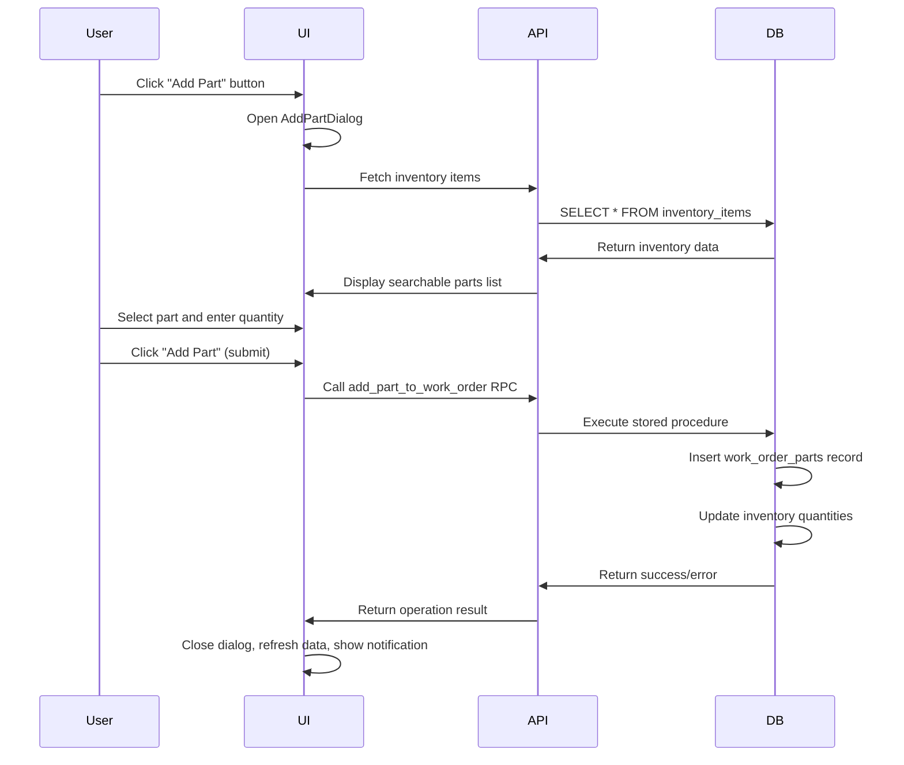

# Add Parts to Work Order Functionality Specification

## Overview
The "Add Parts to Work Order" feature allows technicians and administrators to record inventory parts used during work order execution. This functionality is accessible from the Work Order Details page and provides a streamlined interface for part selection, quantity specification, and automatic inventory tracking.

## User Stories

### Primary User Story
**As a technician or administrator**, I want to add parts used during a work order so that I can accurately track inventory consumption, calculate service costs, and maintain proper stock levels.

### Supporting User Stories
- **As a technician**, I want to search for parts by name or SKU so that I can quickly find the correct inventory item
- **As an administrator**, I want to see real-time inventory levels when adding parts so that I can verify stock availability
- **As a business owner**, I want automatic cost calculation when parts are added so that I can track service profitability
- **As an inventory manager**, I want inventory levels to update automatically when parts are consumed so that I maintain accurate stock records

## Functional Requirements

### FR-1: Add Parts Interface
- **Requirement**: Provide an "Add Part" button in the Work Order Details page
- **Location**: Parts Used card section
- **Access Control**: Available to users with work order edit permissions
- **Visual Design**: Primary button with plus icon and "Add Part" label

### FR-2: Part Selection Dialog
- **Requirement**: Display a drawer-style dialog for part selection
- **Components**:
  - Searchable dropdown with all available inventory items
  - Real-time search filtering by part name and SKU
  - Display format: "Part Name (SKU) - X in stock"
  - Quantity input field with validation (minimum 1, numeric only)
  
### FR-3: Inventory Integration
- **Requirement**: Real-time inventory data display and validation
- **Data Source**: `inventory_items` table
- **Display Information**:
  - Part name and description
  - SKU (Stock Keeping Unit)
  - Current quantity on hand
  - Unit price for cost calculation

### FR-4: Data Persistence
- **Requirement**: Save part usage to work order parts table
- **Database Operation**: Call `add_part_to_work_order` stored procedure
- **Parameters**:
  - `p_work_order_id`: Target work order ID
  - `p_item_id`: Selected inventory item ID  
  - `p_quantity_used`: Specified quantity
- **Transaction**: Atomic operation ensuring data consistency

### FR-5: Cost Calculation
- **Requirement**: Automatic cost calculation and display
- **Formula**: Quantity Used × Unit Price at Time of Use
- **Display**: Individual line totals and grand total
- **Currency**: UGX (Ugandan Shillings)
- **Formatting**: Locale-appropriate number formatting with commas

### FR-6: Real-time Updates
- **Requirement**: Immediate UI updates after successful part addition
- **Behavior**:
  - Close add part dialog
  - Refresh parts used table
  - Update total cost calculation
  - Update inventory quantities
  - Display success notification

## Technical Requirements

### TR-1: Component Architecture
```
WorkOrderDetails (Page)
├── WorkOrderPartsUsedCard (Component)
│   ├── Add Part Button
│   ├── Parts Table Display
│   └── AddPartToWorkOrderDialog (Component)
│       ├── Inventory Search/Select
│       ├── Quantity Input
│       └── Action Buttons
```

### TR-2: State Management
- **Dialog State**: `isAddPartDialogOpen` boolean state
- **Form State**: Ant Design form instance for validation
- **Loading State**: Submission loading indicator
- **Query State**: TanStack Query for data fetching

### TR-3: Data Flow


### TR-4: Database Schema
```sql
-- Core tables involved
work_order_parts (
    id: UUID PRIMARY KEY,
    work_order_id: UUID REFERENCES work_orders(id),
    item_id: UUID REFERENCES inventory_items(id),
    quantity_used: INTEGER NOT NULL,
    price_at_time_of_use: DECIMAL(10,2) NOT NULL,
    created_at: TIMESTAMP DEFAULT NOW()
)

inventory_items (
    id: UUID PRIMARY KEY,
    name: VARCHAR(255) NOT NULL,
    sku: VARCHAR(100) UNIQUE NOT NULL,
    description: TEXT,
    quantity_on_hand: INTEGER NOT NULL,
    unit_price: DECIMAL(10,2) NOT NULL,
    reorder_level: INTEGER DEFAULT 0
)
```

## User Interface Requirements

### UI-1: Add Part Button
- **Style**: Primary button with brand purple color (#6A0DAD)
- **Icon**: Plus icon (ph:plus-fill)
- **Position**: Top-right of Parts Used card header
- **State**: Disabled when work order is completed/closed

### UI-2: Add Part Dialog
- **Type**: Right-side drawer (720px width)
- **Title**: "Add Part to Work Order"
- **Behavior**: Destroys on close to reset form state
- **Responsive**: Adapts to mobile viewports

### UI-3: Form Fields
- **Part Selection**:
  - Component: Searchable Select dropdown
  - Search: Real-time filtering on name and SKU
  - Validation: Required field
  - Display: "Part Name (SKU) - X in stock"
  
- **Quantity Field**:
  - Component: InputNumber
  - Validation: Required, minimum value 1, integers only
  - Placeholder: "e.g. 2"
  - Width: 100% of container

### UI-4: Action Buttons
- **Cancel**: Secondary button, closes dialog without saving
- **Add Part**: Primary button, validates and submits form
- **Loading State**: Shows spinner during submission
- **Keyboard**: Enter key submits form, Escape closes dialog

### UI-5: Parts Display Table
- **Columns**: Part Name (SKU), Quantity, Unit Price, Total, Actions
- **Formatting**: 
  - Quantities: Locale number formatting with commas
  - Prices: "UGX X,XXX" format
  - Actions: Delete button with confirmation dialog
- **Summary**: Total cost row at bottom
- **Empty State**: "No parts used yet" with simple illustration

## Business Rules

### BR-1: Inventory Validation
- Parts can be added even if inventory quantity is insufficient (allows negative stock)
- Warning should be displayed if selected quantity exceeds available stock
- Stock levels are decremented immediately upon part addition

### BR-2: Pricing Rules
- Unit price is captured at time of part addition (price_at_time_of_use)
- Historical pricing is preserved even if inventory item price changes later
- Cost calculations always use the captured historical price

### BR-3: Work Order State Rules
- Parts can only be added to work orders in "In Progress" status
- Completed or cancelled work orders should not allow part additions
- Draft work orders allow part addition for preparation purposes

### BR-4: Permission Rules
- Technicians can add parts to their assigned work orders
- Administrators can add parts to any work order
- Read-only users cannot access add part functionality

## Error Handling

### EH-1: Validation Errors
- **Missing Part Selection**: "Please select a part to add"
- **Missing Quantity**: "Please enter the quantity used" 
- **Invalid Quantity**: "Quantity must be a number greater than 0"
- **Form Validation**: Real-time validation with field-level error messages

### EH-2: System Errors
- **Network Failure**: "Unable to connect. Please check your connection and try again."
- **Database Error**: "An error occurred while saving. Please try again."
- **Inventory Load Failure**: "Could not load inventory items. Please refresh the page."
- **Permission Error**: "You don't have permission to add parts to this work order"

### EH-3: Recovery Actions
- **Retry Mechanism**: Allow users to retry failed operations
- **Form Persistence**: Maintain form values during temporary failures
- **Graceful Degradation**: Show cached data when real-time updates fail
- **Error Reporting**: Log errors for system monitoring and debugging

## Performance Requirements

### PF-1: Load Times
- Inventory items query: < 2 seconds for up to 10,000 items
- Part addition submission: < 1 second for successful operations
- Dialog opening: Immediate (< 100ms) with skeleton loading for data

### PF-2: Search Performance  
- Real-time search filtering: < 200ms response time
- Search indexing: Support for partial matches on name and SKU
- Pagination: Load inventory items in batches if count exceeds 1,000 items

### PF-3: Data Refresh
- Auto-refresh inventory quantities after part additions
- Optimistic UI updates for immediate feedback
- Background sync for inventory level accuracy

## Security Requirements

### SEC-1: Input Validation
- Sanitize all user inputs to prevent injection attacks
- Validate quantity as positive integers only
- Verify work order ID exists and user has access

### SEC-2: Authorization
- Verify user permissions before displaying add part interface
- Validate work order access rights on server side
- Audit trail for all part additions with user attribution

### SEC-3: Data Integrity
- Use database transactions to ensure atomic operations
- Prevent race conditions in inventory quantity updates
- Validate referential integrity between work orders and inventory items

## Testing Requirements

### Test Coverage Areas
1. **Unit Tests**: Form validation, state management, data transformations
2. **Integration Tests**: API calls, database operations, query invalidation
3. **E2E Tests**: Complete user workflow from button click to data persistence
4. **Performance Tests**: Large inventory lists, concurrent part additions
5. **Security Tests**: Permission validation, input sanitization
6. **Accessibility Tests**: Keyboard navigation, screen reader compatibility

### Test Scenarios
- ✅ Add part with valid data
- ✅ Add part with insufficient inventory
- ✅ Form validation error handling
- ✅ Network failure recovery
- ✅ Concurrent user modifications
- ✅ Permission boundary testing
- ✅ Large inventory dataset handling

## Implementation Status

### ✅ Completed Features
- [x] Add Part button in Work Order Details page
- [x] AddPartToWorkOrderDialog component with drawer interface
- [x] Inventory items query with real-time data
- [x] Form validation and error handling
- [x] Part addition mutation with stored procedure integration
- [x] Real-time UI updates and query invalidation
- [x] Cost calculation and display formatting
- [x] Success/error notification system
- [x] Responsive design and mobile compatibility

### 🔧 Technical Implementation
- **Framework**: React + TypeScript with Ant Design components
- **State Management**: TanStack Query for server state, React useState for local state
- **Database**: Supabase PostgreSQL with RPC stored procedures
- **Styling**: Ant Design theme with custom brand colors
- **Validation**: Ant Design form validation with custom rules

### 📋 Future Enhancements
- [ ] Barcode scanning for part selection
- [ ] Batch part addition for multiple items
- [ ] Part recommendation based on work order type
- [ ] Integration with procurement system for automatic reordering
- [ ] Advanced inventory tracking with lot numbers and expiration dates
- [ ] Mobile-first interface optimization
- [ ] Offline capability with sync when connection restored

## Acceptance Criteria

### Primary Flow Success Criteria
1. **Given** a work order in "In Progress" status
2. **When** I click the "Add Part" button  
3. **Then** the Add Part dialog opens with searchable inventory list
4. **When** I select a part and enter quantity
5. **And** I click "Add Part" to submit
6. **Then** the part is saved to the work order
7. **And** the dialog closes automatically
8. **And** the parts table updates with the new entry
9. **And** inventory quantities are decremented
10. **And** a success message is displayed

### Error Handling Success Criteria
1. **Given** invalid form data is entered
2. **When** I attempt to submit the form
3. **Then** validation errors are displayed clearly
4. **And** the form remains open for correction

### Performance Success Criteria
1. **Given** a large inventory dataset (1000+ items)
2. **When** I open the Add Part dialog
3. **Then** the interface loads within 2 seconds
4. **And** search filtering responds within 200ms

---

*This specification documents the complete Add Parts to Work Order functionality as implemented in the Hopping Tiger CMMS system. It serves as both technical documentation and requirements specification for future enhancements.*